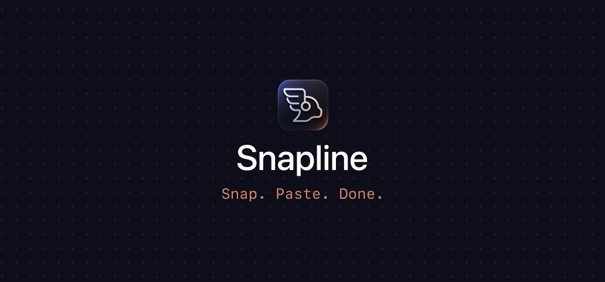

<p align="center">
  
</p>

<p align="center">
  
  
  
</p>

# Snapline

> **Snap. Paste. Done.** — screenshots, straight into your conversation.

Menu-bar Mac app. Hit a hotkey, drag a region, image lands directly in your Claude Code conversation (or any target app you choose). No Dock icon, no clutter.

Built for piping screenshots into a Claude Code TUI session, but works with any app that accepts pasted images — Claude desktop, Slack, Figma, you name it.

## Hotkeys

- **⌘⇧9** — Single Shot. Brings your target app to front, pastes the screenshot.
- **⌘⌥⇧9** — Multi Shot. Pastes into the target's last-used window in the background; you stay in your current app and can rip off more screenshots without ever losing focus.

## Install

> Prerequisites: macOS 13+, Xcode Command Line Tools (`xcode-select --install`).

```bash
git clone https://github.com/N-O-P-E/snapline.git
cd snapline

# 1. One-time: create a self-signed code-signing certificate in your login
#    keychain. This is what makes macOS remember the permissions you grant
#    across rebuilds.
./create-cert.sh

# 2. Build the .app
./build.sh

# 3. Launch — onboarding window walks you through the rest
open build/Snapline.app
```

The onboarding window asks for two macOS permissions and one app preference:

1. **Accessibility** — required to synthesize the paste keystroke into your target app.
2. **Screen Recording** — required by macOS's region selector (`screencapture`).
3. **Target App** — pick the app you want screenshots to be pasted into (Ghostty, iTerm2, Warp, Claude desktop, anything).

After that, ⌘⇧9 / ⌘⌥⇧9 work from anywhere.

## Paste shortcut

Different apps listen for different paste shortcuts. Snapline auto-detects:

- **Claude Code in a terminal (Ghostty, iTerm2, Warp, Kitty, Alacritty, Terminal, WezTerm, …)** → ⌃V. Necessary on macOS because terminal emulators capture ⌘V before it reaches Claude Code.
- **Regular Mac apps (Claude desktop, Slack, Figma, browsers, …)** → ⌘V.

If the auto-detection ever picks wrong, override it from the menu-bar icon → *Paste Shortcut* → *Always ⌘V* / *Always ⌃V*.

## Architecture

```
Sources/Snapline/
├── main.swift              # NSApplication entry, .accessory activation policy
├── AppDelegate.swift       # Status bar item, target picker submenu, onboarding dispatch
├── HotkeyManager.swift     # Carbon RegisterEventHotKey for both ⌘⇧9 and ⌘⌥⇧9
├── CaptureAndPaste.swift   # screencapture -i -c -x → activate target → CGEvent paste
│                           # (multi-shot uses CGEvent.postToPid for background paste)
├── MenuBarIcon.swift       # Hand-coded NSBezierPath template image
├── OnboardingWindow.swift  # SwiftUI 3-step setup: Accessibility, Screen Recording, Target
└── Settings.swift          # UserDefaults wrapper
```

Zero external Swift package dependencies — only Apple frameworks (AppKit, SwiftUI, Carbon.HIToolbox, ApplicationServices, CoreGraphics).

## Why a self-signed certificate?

macOS attaches Privacy & Security grants (Accessibility, Screen Recording) to a signed app's identity. Ad-hoc signatures (`codesign --sign -`) change every rebuild because they're tied to the binary hash, so TCC treats every rebuild as a fresh app and re-prompts.

`create-cert.sh` generates a self-signed code-signing cert in your login keychain. `build.sh` looks for it and signs each build with that stable identity. After the first grant, future rebuilds keep the permissions.

The cert never leaves your machine.

## Resetting permissions

If permissions get stuck after a refactor or rebuild loop, wipe and re-grant:

```bash
killall Snapline 2>/dev/null
tccutil reset ScreenCapture com.studionope.Snapline
tccutil reset Accessibility com.studionope.Snapline
open build/Snapline.app
```

## License

[MIT](LICENSE) © studionope
